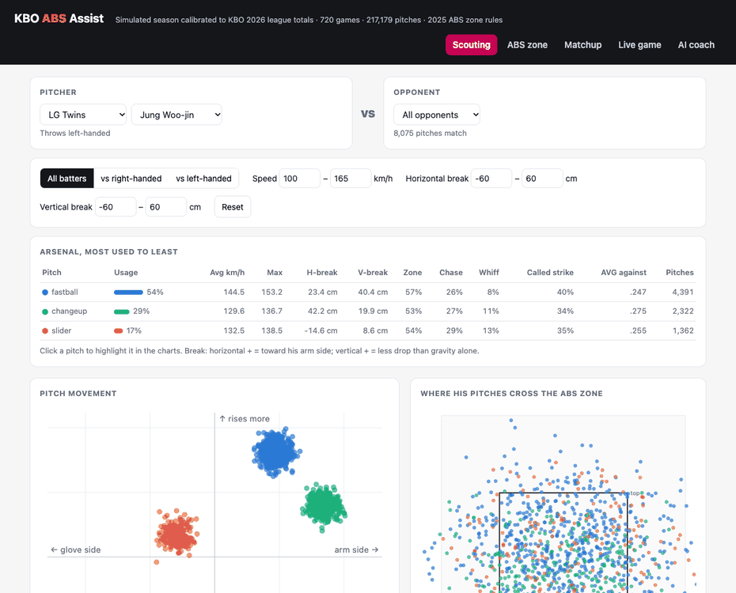
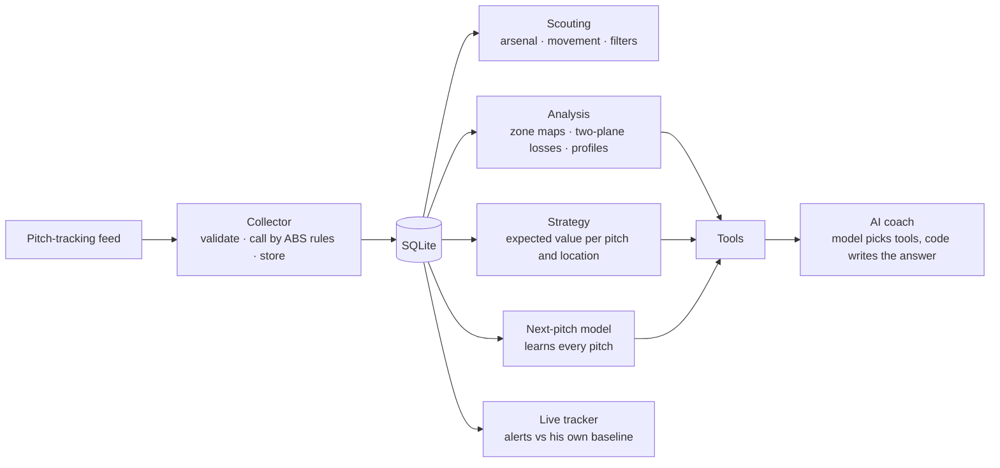

# KBO ABS Assist

[](https://github.com/joeljo2347-bit/kbo-abs-assist/actions/workflows/tests.yml)


[](https://github.com/astral-sh/ruff)
[](https://mypy-lang.org/)

Collects pitch-by-pitch ABS (automated ball-strike) data, calls every pitch by the KBO's published
zone rules and explains why, then turns it into decisions: how a pitcher attacks a team, what to
throw in each count, which pitches a hitter should take, what comes next, and when a pitcher is
fading. Coaches can talk to it in plain language. Runs on localhost.


<sub>A real session on localhost. The league is simulated and calibrated to the KBO's official 2026 totals.</sub>

## Where this comes from

I worked as a data scientist and strategic data analyst for the LG Twins in the KBO, the first
league to call every pitch with ABS (since 2024). This repo rebuilds that kind of work from
scratch so anyone can run it; no team data is used.

It matters beyond Korea now: MLB brings an ABS challenge system to the majors in 2026.

## What the data says

Called by the KBO's published 2025 zone rules, on a season calibrated to the 2026 league:

- **ABS takes the low curveball away.** ABS checks the bottom of the zone twice, at the middle of
  the plate and at its back edge, and a pitch is still dropping in between. Of taken pitches in the
  bottom tenth of the zone at the middle of the plate, ABS called **80% of curveballs balls, versus
  52% of fastballs**: by the back edge, the curveball has fallen out.
- **The geometry gives a rule of thumb.** Across the back half of the plate (21.59 cm), a fastball at
  a typical 4.8° approach angle drops about 1.8 cm; a curveball at 9.4° drops about 3.6 cm. A
  curveball at the knees has to cross the middle of the plate about **3.6 cm above the bottom
  edge** to stay a strike, twice the margin a fastball needs.
- **That's 3.5% of all taken pitches** (4,107 of 115,849): inside the zone at the middle of the
  plate, called balls at the back.
- **Pitch type is predictable, up to a limit.** Learning each pitcher's habits by count, batter side
  and previous pitch, the model calls the next pitch type 54.1% of the time, within one point of
  the best any model could do given how pitchers mix.

## What it does

| View | For whom | What it shows |
|---|---|---|
| **Scouting** | Advance scouts | A pitcher (left) against a team (right), filtered by batter side, speed and break: his arsenal ranked from most to least used (velocity, horizontal and vertical break, zone, chase, whiff, called-strike rates, average against), a pitch-movement chart and where his pitches cross the zone |
| **ABS zone** | Analysts | Every taken pitch against the batter's own zone; click one to see exactly why ABS called it ("Ball: 0.4 cm outside the bottom, back of plate edge") |
| **Matchup** | Pitching coaches | For a pitcher, batter and count: the pitches and locations that give the hitter the least, the next-pitch prediction, and the hitter's take guide |
| **Live game** | Dugout | A game replayed pitch by pitch: the prediction before each pitch, what was thrown, and live alerts against the pitcher's own baseline |
| **AI coach** | Staff | A conversation: ask, follow up ("why?", "and with two strikes?"), and get short answers with the key numbers laid out next to them |

## How it works



| Part | What it does | Where |
|---|---|---|
| ABS engine | The published KBO zone: top and bottom as a share of the batter's height (55.75% / 27.04% in 2025, 56.35% / 27.64% in 2024), checked at the middle and back of the plate; sides 47.18 cm, checked at the middle. Every call names the edge that decided it | `abs_assist/zone.py` |
| Collector | Validates each pitch event (including handedness and movement), calls it by the rules, flags feed calls that disagree, refuses duplicates | `abs_assist/collect.py` |
| Scouting | Arsenal by usage with velocity, break and outcome rates; filters for batter side, speed and break | `abs_assist/scouting.py` |
| Strategy | The batter's expected run value (wOBA-style weights for how the plate appearance ends) after every pitch type and location in a count, from swing, whiff, foul, contact and called-strike rates, scaled by the batter's tendencies | `abs_assist/strategy.py` |
| Next-pitch model | Each pitcher's choices by batter side, count situation (ahead, behind, even, two strikes) and previous pitch, backing off to broader patterns when data is thin. Updates after every pitch | `abs_assist/predict.py` |
| Live tracker | Velocity against his own early pitches today (beyond normal noise), zone rate against his norm, pitch-count milestones | `abs_assist/live.py` |
| AI coach | A language model reads the conversation and picks the analysis tools and their arguments. The answer is then written in code from the results, shaped by what was asked (a yes or no from where a player ranks, a comparison, a split, a count), and code fills in lookups the model skipped. The model's own wording is never shown | `abs_assist/coach.py`, `compose.py`, `fallback.py`, `tools.py`, `visuals.py` |

## The league: simulated, calibrated to real KBO totals

There is no public pitch-by-pitch ABS feed, so the league is simulated: the ten real KBO clubs with
fictional players (so no real player's numbers are misrepresented). Pitchers have a throwing hand,
arsenals with typical pro speeds and movement, approach angles, command, count and platoon
tendencies, sequencing habits and stamina. Batters have heights (which set their zones), a batting
side, discipline, contact and power. Contact quality depends on location and the platoon matchup.

Three behavioral settings (whiff, hit and power rates) were then **fitted to the KBO's official
2026 league totals** by grid search, with foul and swing rates fixed at typical pro values, scoring each setting across three different simulated leagues and checking the winner on
a fresh season ([evals/calibration.md](evals/calibration.md)):

| | KBO 2026 (official) | Simulation, fresh season |
|---|---|---|
| Strikeouts | 19.5% | 19.5% |
| Walks | 9.4% | 9.9% |
| Home runs | 2.4% | 2.5% |
| Batting average | .268 | .264 |
| Pitches per plate appearance | 3.90 | 3.76 |

Source: KBO official team records, 2026 regular season through 704 of 720 games
([batting](https://www.koreabaseball.com/Record/Team/Hitter/Basic1.aspx),
[batting 2](https://www.koreabaseball.com/Record/Team/Hitter/Basic2.aspx),
[pitching](https://www.koreabaseball.com/Record/Team/Pitcher/Basic2.aspx)), retrieved 6 October 2026.
Conclusions about the ABS rule follow from its geometry; conclusions about strategy are as good as
the simulation.

## Evaluation

Every number here is reproducible with the scripts in `evals/`.

**Next-pitch prediction** ([evals/predict_results.md](evals/predict_results.md)): predicted before
each pitch, learned after, over a 720-game season. "Ceiling" is the simulation's own odds, the best
any model could do.

| Games seen | Model | Pitcher's most common pitch | Always fastball | Ceiling |
|---|---|---|---|---|
| 0-120 | **50.9%** | 48.8% | 47.9% | 55.0% |
| 600-720 | **54.1%** | 49.3% | 47.8% | 54.9% |

**Live fatigue alerts** ([evals/live_results.md](evals/live_results.md)): thresholds were set on
one simulated season and are reported on another.

| | Held-out season |
|---|---|
| Fatigue caught by the velocity alert | 25 of 434 tired outings (6%) |
| False alarms | 6.2% of outings |

Velocity alone is a weak fatigue signal: starters come out about 15 pitches after they start to
tire, before the drop (about 1 km/h) clears normal pitch-to-pitch noise. The alert is tuned to
rarely cry wolf; catching fatigue earlier needs more than velocity (command, spin, release).

**AI coach, graded blind.** A separate grader, new for every run and told nothing about the project,
sees each question, every tool call with its result, and the answer, with no expected answers, and
is told to fail anything in doubt. It checks that every number and claim is supported by a tool
result and that the answer addresses the question.

The honest number is the score on questions the coach has never been tuned on. Each held-out set
was written and committed before the changes that followed it, run once, and reported as it came out.

**First design: the model wrote the answers**, with checks in code that sent back unsupported numbers,
wrong units, contradicted verdicts and so on.

| Held-out set | 1 | 2 | 3 | 4 | 5 | 6 | 7 | 8 | 9 | 10 |
|---|---|---|---|---|---|---|---|---|---|---|
| Passed when new | [2](evals/heldout-before/results.md) | [3](evals/heldout2-before/results.md) | [4](evals/heldout3-before/results.md) | [6](evals/heldout4-first-run/results.md) | [6](evals/heldout5-first-run/results.md) | [5](evals/heldout6-first-run/results.md) | [8](evals/heldout7-first-run/results.md) | [6](evals/heldout8-first-run/results.md) | [5](evals/heldout9-first-run/results.md) | [3](evals/heldout10-first-run/results.md) |

It levelled off at 5-6 out of 10: every new check fixed what it targeted and the model found new
ways to word things wrong (inverting a comparison, overstating "avoid a splitter" when one location
was flagged). The first held-out set also exposed the original ten-question score
(9/10, [rounds 1-6](evals/blind-round6/results.md)) as overfit.

**Current design: the model only chooses tools; code writes the answer** (`abs_assist/compose.py`).

| Held-out set | 11 | 12 | 13 |
|---|---|---|---|
| Passed when new | [9](evals/heldout11-first-run/results.md) | [8](evals/heldout12-first-run/results.md) | [**10**](evals/heldout13-first-run/results.md) |

All fourteen sets (the original ten questions and held-out sets 1-13) rerun and regraded on this
design pass **132 of 140** ([original](evals/blind/results.md), [1](evals/heldout/results.md) ...
[13](evals/heldout13/results.md)). Sets 1-12 had been seen while building it, so treat 132/140 as the
level on known kinds of question and the held-out sets as the test of new ones. The remaining misses
are wording (a take-or-swing lead that overstated, a share stored too coarsely so 3.545% showed as 3.6%)
and one model-server error; all three are fixed since, and those fixes have not been through a fresh held-out set yet.

## Run it

```bash
python3 -m venv .venv && .venv/bin/pip install -r requirements.txt -r requirements-dev.txt
.venv/bin/pytest -q                                   # no model needed
.venv/bin/uvicorn abs_assist.api:app --port 8000      # first start builds the season (~20 s)
open http://localhost:8000
```

The AI coach needs a chat model at an OpenAI-compatible endpoint: set `MODEL_URL` (e.g.
`http://localhost:8080/v1`) and `MODEL_NAME`; `MODEL_REASONING=medium` trades speed for a little accuracy
(default `low`). I use a self-hosted open-weight model. Everything else
runs without one. Docker: `docker build -t kbo-abs-assist . && docker run -p 8000:8000 kbo-abs-assist`
(add `-e MODEL_URL=... -e MODEL_NAME=...` for the coach).

```bash
python -m evals.calibrate           # fit the league to the KBO totals
python -m evals.predict_eval        # next-pitch prediction
python -m evals.live_eval           # fatigue alerts, dev vs held-out season
python -m evals.coach_eval run      # coach answers (needs the model), then packet / score
python -m evals.coach_eval run heldout13  # a held-out set (heldout, heldout2 ... heldout13)
```

## Design decisions

- **Rules in code, not in a model.** ABS calls are deterministic and must be explainable to the
  centimetre, so the engine is plain code with hand-worked tests.
- **Small, auditable models.** The next-pitch model is counts with back-off, not a neural net: it
  trains in seconds, learns online, and any prediction can be traced to the pitches behind it.
- **The language model chooses; code answers.** A small local model is good at understanding a
  question and picking tools, and unreliable at wording numbers (it inverted comparisons and
  overstated results however many checks were added). So it only picks tools, and the answer is
  written in code from their results.
- **Honest evaluation.** Calibration checked on a fresh season, held-out seasons for anything tuned,
  a ceiling for prediction, and blind grading for the coach, with failures published.
- Every function is 30 lines or fewer, enforced by a test; ruff and mypy run in CI.

## Limits

- Pitch-level behaviour is simulated; league totals are real. The ABS geometry is real.
- Locations are grouped into broad regions; a team version would use finer grids and pitch shape.
- Built to ingest a club's own tracking feed, which is where it would earn its keep.
