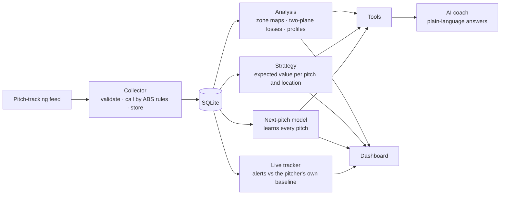

# KBO ABS Assist

[](https://github.com/joeljo2347-bit/kbo-abs-assist/actions/workflows/tests.yml)


[](https://github.com/astral-sh/ruff)
[](https://mypy-lang.org/)

Collects pitch-by-pitch ABS (automated ball-strike) data, calls every pitch by the KBO's published
zone rules and explains why, then turns it into decisions: what to throw in each count, which
pitches a hitter should take, what the pitcher throws next, and when a pitcher is fading. Coaches
can ask it questions in plain language. Runs on localhost.


<sub>A real session on localhost, simulated 2025 season (216,549 pitches).</sub>

## Where this comes from

I worked as a data scientist and strategic data analyst for the LG Twins in the KBO, the first
league to call every pitch with ABS (since 2024). This repo rebuilds that kind of work from
scratch on a simulated season, so anyone can run it; no team data is used.

It matters beyond Korea now: MLB brings an ABS challenge system to the majors in 2026.

## What the data says

From the simulated 2025 season, called by the KBO's published 2025 rules:

- **ABS takes the low curveball away.** ABS checks the bottom of the zone twice, at the middle of
  the plate and at its back edge, and a pitch is still dropping in between. Among taken pitches in
  the bottom tenth of the zone at the middle of the plate, ABS called **82% of curveballs balls,
  versus 52% of fastballs**: by the back edge, the curveball has fallen out.
- **The geometry gives a rule of thumb.** Across the back half of the plate (21.59 cm), a fastball at
  a typical 4.8° approach angle drops about 1.8 cm; a curveball at 9.4° drops about 3.6 cm. A
  curveball at the knees has to cross the middle of the plate about **3.6 cm above the bottom
  edge** to stay a strike, twice the margin a fastball needs.
- **That's 3.5% of all taken pitches** (4,142 of 117,658): inside the zone at the middle of the
  plate, called balls at the back. Curveballs, fastballs and splitters lose the most.
- **Pitch type is predictable, up to a limit.** Learning each pitcher's count and sequencing habits,
  the model calls the next pitch type 55.6% of the time, within one point of the best any model
  could do given how pitchers mix.

## How it works



| Part | What it does | Where |
|---|---|---|
| ABS engine | The published KBO zone: top and bottom as a share of the batter's height (55.75% / 27.04% in 2025, 56.35% / 27.64% in 2024), checked at the middle and back of the plate; sides 47.18 cm, checked at the middle. Every call says which edge decided it and by how many cm | `abs_assist/zone.py` |
| Collector | Validates each pitch event, calls it by the rules (never trusting the feed's own label), flags feed calls that disagree, refuses duplicates | `abs_assist/collect.py` |
| Analysis | Called-strike rates by location relative to each batter's own zone, strikes lost at the back of the plate, pitcher and batter profiles | `abs_assist/analyze.py` |
| Strategy | For a pitcher, batter and count: the expected run value for the batter of every pitch type and location, from swing, whiff, foul, contact and called-strike rates, scaled by the batter's own tendencies. Also which pitches a hitter should take | `abs_assist/strategy.py` |
| Next-pitch model | Counts each pitcher's choices by count situation and previous pitch, backing off to broader patterns when data is thin. Updates after every pitch | `abs_assist/predict.py` |
| Live tracker | Velocity against the pitcher's own early pitches today (beyond normal noise), zone rate against his norm, pitch-count milestones | `abs_assist/live.py` |
| AI coach | A language model picks the analysis tools and explains their results. A check in code requires every number in the answer to come from a tool | `abs_assist/coach.py`, `tools.py` |
| Dashboard | Zone map with click-to-explain, matchup advice, live game replay, coach chat | `abs_assist/api.py`, `static/` |

## Evaluation

Every number here is reproducible with the scripts in `evals/`.

**Next-pitch prediction** ([evals/predict_results.md](evals/predict_results.md)): predicted before
each pitch, learned after, over a 720-game season. "Ceiling" uses the simulation's own odds, the
best any model could do.

| Games seen | Model | Pitcher's most common pitch | Always fastball | Ceiling |
|---|---|---|---|---|
| 0-120 | **53.5%** | 50.6% | 47.5% | 56.3% |
| 600-720 | **55.6%** | 50.9% | 47.0% | 56.6% |

**Live fatigue alerts** ([evals/live_results.md](evals/live_results.md)): thresholds were set on
one simulated season and are reported on a different one.

| | Held-out season |
|---|---|
| Fatigue caught by the velocity alert | 24 of 354 tired outings (7%) |
| False alarms | 6.5% of outings |

Velocity alone is a weak fatigue signal here: starters come out about 15 pitches after they start
to tire, before the drop (about 1 km/h) clears normal pitch-to-pitch noise. The alert is tuned to
rarely cry wolf; catching fatigue earlier needs more than velocity (command, spin, release).

**AI coach, graded blind** ([round 1](evals/blind-round1/results.md), [round 2](evals/blind/results.md)):
ten realistic questions, including one the data can't answer (ERA) and one that needs several
lookups. A separate grader saw only each question, every tool call with its result, and the
answer, with no expected answers.

| | Passed |
|---|---|
| Round 1 | 5/10 |
| Round 2, after fixing name lookup and making every tool explain its fields | **8/10** |

Still failing: with no pitcher named, it asks for one instead of answering from the batter's
weaknesses; and once it reported the right whiff rates but named the wrong pitcher.

## The simulated season

Teams are the ten real KBO clubs; every player is fictional, so no real player's numbers are
misrepresented. Pitchers have arsenals, approach angles, command, count tendencies, sequencing
habits and stamina; batters have heights (which set their zones), discipline, contact and power;
contact quality depends on location, and hanging breaking balls are punished. The season comes out
at a .227 average, 10.8% walks, 2.5% home runs and 3.84 pitches per plate appearance, close to a
real league; strikeouts run high at 25.7%. Conclusions about the ABS rule follow from its geometry;
conclusions about strategy are as good as the simulation.

## Run it

```bash
python3 -m venv .venv && .venv/bin/pip install -r requirements.txt -r requirements-dev.txt
.venv/bin/pytest -q                                   # 33 tests, no model needed
.venv/bin/uvicorn abs_assist.api:app --port 8000      # first start builds the season (~20 s)
open http://localhost:8000
```

The AI coach needs a chat model at an OpenAI-compatible endpoint: set `MODEL_URL` (e.g.
`http://localhost:8080/v1`) and `MODEL_NAME`. I use a self-hosted open-weight model. Everything else
runs without one. Docker: `docker build -t kbo-abs-assist . && docker run -p 8000:8000 kbo-abs-assist`
(add `-e MODEL_URL=... -e MODEL_NAME=...` for the coach).

```bash
python -m evals.predict_eval        # next-pitch prediction
python -m evals.live_eval           # fatigue alerts, dev vs held-out season
python -m evals.coach_eval run      # coach answers (needs the model), then packet / score
```

## Design decisions

- **Rules in code, not in a model.** ABS calls are deterministic and must be explainable to the
  centimetre, so the engine is plain code with hand-worked tests.
- **Small, auditable models.** The next-pitch model is counts with back-off, not a neural net: it
  trains in seconds, learns online, and any prediction can be traced to the pitches behind it.
- **The language model only explains.** Numbers come from tools; a check sends back any number that
  doesn't.
- **Honest evaluation.** Held-out seasons for anything tuned, a ceiling for prediction, and blind
  grading for the coach, with failures published.
- Every function is under 30 lines, enforced by a test; ruff and mypy run in CI.

## Limits

- Simulated data. The ABS geometry is real; player behaviour is modelled.
- Locations are grouped into broad regions; a team version would use finer grids and pitch shape.
- Not a substitute for the club's own tracking data, which this is built to ingest.
